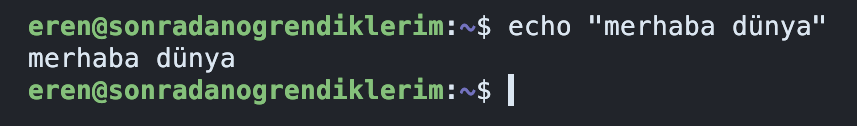
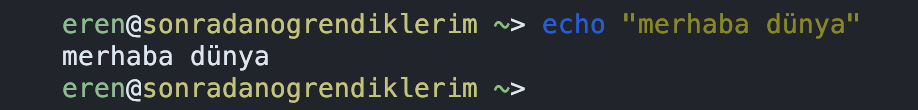
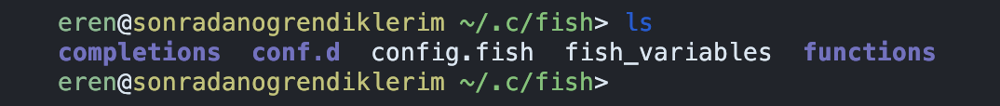

<!-- markdownlint-disable MD046 -->

## Ön Tanımlı Ayarlar

Önceki bölümde gördüğümüz terminal sadece kendisine kadar ayar (konfigürasyon) içeriyor. Dilerseniz
bu şekilde de kullanabilirsiniz ancak ben bu şekilde kullanmayı tercih etmiyorum.

<!-- markdownlint-disable MD033 -->
<figure markdown="span">
  
  <figcaption>Ön tanımlı Gnome terminali</figcaption>
</figure>

Zamanımızın neredeyse tamamı bu uygulama içerisinde geçeceğinden olabildiğince rahat edebileceğim
şekilde ayarlamayı tercih ediyorum. Bu bölümde [shell][shell]{:target="_blank"} nedir,
[bash][bash]{:target="_blank"} yerine [fish][fish]{:target="_blank"} nasıl kullanılır ve fish
ayarları nasıl yapılır göreceğiz.

## Shell

Buna bir çeşit farklı bir kullanıcı arayüzü diyebiliriz. Şu anda ekranda gördüğünüz bir grafik
arayüzü. Bilgisayarınızla grafik arayüzü ile işlem yapıyorsunuz ve grafik arayüzünün size tanıdığı
olanaklar ne ise onunla sınırlısınız. Dosya kopyalama, düzenleme, silme gibi işlemleri sizden
istenilen şekilde yapmak durumundasınız. Windows, OS X gibi kullanıcı arayüzlerini burada örnek
gösterebiliriz.

Arayüzler sadece grafik ile sınırlı değil. Metin tabanlı arayüzler de bunlardan bir tanesi ve biz
metin tabanlı arayüzler ile ilgileniyoruz. Hatırlarsanız metin tabanlı
[arayüzleri][vt100]{:target="_blank"} önceki bölümde görmüştük ve modern dünyada
[emüle][emulator]{:target="_blank"} ederek kullanıyorduk.

[vt100]: ./terminal.md#terminal
[emulator]: ./terminal.md#linux-terminal-emulatoru

## Bash

Ubuntu ile ön tanımlı olarak gelen metin tabanlı arayüz. Grafik arayüzünüz ile `gnome-terminal`
açtığınızda bu __program__, bir başka deyişle bu __uygulama__ çalışır. Programı özellikle
belirtiyorum çünkü bu Firefox veya LibreOffice gibi bir program. Sadece metin tabanlı olarak
çalışmakta.

Her uygulama gibi bunun da bir ayar dosyası mevcut. Uygulama başlangıçta bu dosyayı okuyup
çalışmasına devam ediyor. Bu ayar dosyasını şimdilik göremiyorsunuz çünkü gizli :)

### Linux ve Benzeri Sistemlerde Gizli Dosyalar

Aslında değil tabii ki. Linux ve benzeri sistemlerde gizli dosyalar nokta karakteri ile başlar ve ön
tanımlı olarak dosya yöneticilerinde gösterilmezler. Terminalinize aşağıdaki komutları yazın ve
aradaki farkı görün:

```sh
ls
```

```sh
ls -a
```

`ls` komutuna verdiğiniz `-a` parametresi bütün dosyaları görmek istediğinizi söyler.

Bu komutunun hangi parametrelerini alacağını da `ls --help` komutu ile öğrenebilirsiniz. Bir göz
atmanızda fayda var.

### Bash Ayarları

Bahsettiğimiz ayar dosyasının ismi `.bashrc`. Bunu herhangi bir editör ile açarak
inceleyebilirsiniz. Bash yerine fish kullanacağımız için içerisinde yazanları anlamlandırmamıza
gerek yok. Göz atmanız yeterli. Bu dosyanın içeriğini aşağıdaki komut ile görebilirsiniz:

```sh
cat .bashrc
```

`cat` komutu sonrasında gelen herhangi bir dosyanın içeriğini ekrana basacaktır.

## Fish

Artık metin tabanlı arayüz kullanacağımız için ekran görüntülerine `gnome-terminal` gibi arayüzleri
eklemeyeceğiz. Şu anda terminalimiz şu şekilde görünmekte:

{ width=500 }

Bu belgenin sonunda terminalimiz bir [git][git]{:target="_blank"} reposu dizinine girdiğinizde
aşağıdaki şekilde görünecek:

{ width=500 }

Artık tekrar etmeye gerek yok ancak yine de tekrar edelim. [Fish][fish]{:target="_blank"} de bash
gibi bir arayüz ve bir uygulama. Sadece bazı noktalarda avantajları ve dezavantajları var. Ben bash
yerine fish kullanmayı tercih ediyorum çünkü ön tanımlı ayarları bana daha uygun geliyor.

Avantajlarından bahsederken dezavantajlarından bahsetmemek olmaz. Fish kullandığınızda bash için
yazılmış komutlarda hatalarla karşılaşabilirsiniz. Tek bir komut ile yüklenen uygulamalar genellikle
bash ile yazıldığı için bu noktada sorunla karşılaşacaksınız ancak bunu da fish değil bash ile
çalıştırılarak çözülebiliyor. Bu ileri bir konu, fish ve bash scriptlerinin farklarını bilmemize
şimdilik ihtiyacımız yok.

Bash ve Fish ile birlikte [Zsh][zsh]{:target="_blank"} de en çok tercih edilen uygulamalar arasında.
Tercihinizi bu yönde de yapabilirsiniz ancak kişisel olarak Fish kullandığım için belgede bundan
bahsediyoruz.

### Fish Yükleyelim

Terminalde aşağıdaki komutu çalıştırın:

```sh
sudo apt-get install fish
```

!!! note "Sudo komutu"
    Buradaki `sudo` komutu, sonrasında gelen her şeyi yetkili kullanıcı ile çalıştırmayı sağlar.
    Bir uygulama yüklerken şu an olduğu gibi yetkisiz bir kullanıcı ile yüklemeye çalıştığımızda
    belirli dizinlere erişim sağlanamayacağından uygulama da yüklenemeyecektir.

    Bu örnekte alacağımız hata aşağıdakine benzer olacaktır:

    ```
    E: Could not open lock file /var/lib/dpkg/lock-frontend - open (13: Permission denied)
    E: Unable to acquire the dpkg frontend lock (/var/lib/dpkg/lock-frontend), are you root?
    ```

Yükledikten sonra direkt olarak terminalimize `fish` yazarak çalıştırmaya başlayabiliriz. Hiçbir
ayar yapmadığımızda aşağıdaki gibi bir arayüz bizi karşılayacak:

{ width=500 }

### Fish Ayarları

Bu uygulamada da ayar dosyaları mevcut. İlgili dizinler ve dosyalar nokta karakteri ile başlıyor,
yani gizli görünmesi isteniyor.
Fish için ayarlar [.config/fish/fish.config][fish-config]{:target="_blank"} dosyasında yer alıyor.

Dikkat ederseniz fish ayrı bir dizin içerisine ayar dosyalarını koymuş durumda. Bu her shell için
değişecektir. Bash için tek bir ayar dosyası _(.bashrc)_ varken, fish için durumun farklı olduğunu
görüyoruz. Yukarıda bahsettiğim tercih sebeplerinden bir tanesinin bu olduğunu da hatırlatmak
isterim.

Artık ayar dosyasının hangi dizinde olduğunu öğrendiğimize göre, dikkatimizi sadece o dizine
yöneltebiliriz. Fish ayarları yaparken kullanacağımız dizin her daim `.config/fish` olacak.

#### Ayar Eklemeye Giriş

Fish ayar dizini içerisine girerek dikkatimizi yönlendirmeye başlayalım. Terminalde aşağıdaki komutu yazarak bu dizin içerisine girebilirsiniz:

```sh
cd ~/.config/fish
```

!!! note "~ karakteri"
    Bu karakter linux ve benzeri sistemlerde [ev dizinini][home-dir]{:target="_blank"} ifade eder.
    Bash ve Fish'i tanımlarken metin tabanlı arayüz ile shell demiştik. Bunların görevlerinden bir
    tanesi de bu gibi özel karakterleri doğru şekilde yorumlamak. Kullanıcı adınıza bağlı olarak ~
    karakteri farklı dizinleri gösterecektir. Benim sistemimde bu `/home/eren` olarak görünmekte.
    Dolayısıyla yukarıdaki komutu ~ ile başlattığımızda öncelikle ev dizinimizi, sonrasında fish
    ayar dizinini ifade etmekteyiz. Bunu `echo` komutu ile rahatlıkla test edebiliriz:

    ```sh
    echo ~/.config/fish
    ```

Terminal ile şu anda bu dizin içerisindeyiz. Herhangi bir parametre vermeden dosyaları
listelediğimizde, yani `ls` komutunu kullandığımızda, aşağıdaki çıktıyı göreceğiz:

{ width=500 }

Bu dosyaları ve dizinleri biz oluşturmadık. Fish yüklendiği ve ilk açıldığı sırada oluşturuldular. Yapmamız gereken Fish'in istediği şekilde yeni bir ayar eklemek.

#### Yeni Ayar: Hoş Geldiniz Mesajı

Fish ilk açıldığında her daim hoş geldiniz mesajını terminalimize göndermekte. Bu benim pek
hoşlanmadığım bir durum. Zaten kullanıyoruz ve tekrar bu mesajı görmemizin pek bir anlamı yok. Neyse
ki bunu bir ayar ile kapatabiliyoruz. Yapmamız gereken `config.fish` dosyasına istenilen şekilde bir
satır eklemek.

Bu aşamada genellikle [nano][nano]{:target="_blank"} veya [vim][vim]{:target="_blank"} gibi terminal
tabanlı metin editörlerine değinilse de ben bunun ileri aşama olduğunu düşünüyorum. Terminale henüz
elimiz alışıyor ve gerektiği yerde grafik arayüzünün kullanılması öğrenimimizi kolaylaştırıyor. Bu
açıdan aşağıdaki komutu girerek terminalde içinde bulunduğumuz dizine grafik arayüzünden erişelim:

```sh
xdg-open .
```

Bu komut dosya yöneticisini `.config/fish` dizininde açacaktır ve `ls` ile gördüğümüz dosyaları aynı
şekilde gösterecektir. Dosyaya çift tıklayarak düzenlemeye başlayabilirsiniz. Ön tanımlı olarak
aşağıdaki satırları göreceksiniz:

```sh
if status is-interactive
    # Commands to run in interactive sessions can go here
end
```

Buradaki `is-interactive` kontrolüne henüz ihtiyacımız yok. Bu açıdan bu satırları silip kaydedin ve
elimizde boş bir `config.fish` dosyası olsun. Sonrasında hoş geldin mesajını kapatmak için fish
[belgelerine][fish-docs]{:target="_blank"} bakmamız gerekecek ve bu da Bilgisayar Mühendisliğinde
zamanımızın büyük bir çoğunluğunu oluşturuyor :)

Bu ayarı bulması biraz zor. Bu yüzden Google'a `fish disable greeting` yazarak nasıl yapıldığını
aramaya başlıyoruz ve görüyoruz ki bu bir [ortam değişkeni][env-var]{:target="_blank"}. Dolayısıyla
fish içerisinde kapatıp açacağımız bir ayardan ziyade içerisine bir şeyler yazacağımız bir değişken
diyebiliriz. Şimdilik bu kadarını bilmemiz yeterli.

Sonuç olarak bu değişkenin içeriğini boş yaptığımızda istediğimize ulaşmış oluyoruz. Bunu da
`config.fish` dosyasına aşağıdaki satırı ekleyerek yapıyoruz:

```sh
set fish_greeting ""
```

!!! tip "Çift tırnak"
    Buraya çift tırnak koymak zorunda değiliz, direkt olarak `set fish_greeting` şeklinde
    kullanabiliyoruz ancak içerisini boş olarak doldurduğumuzu belirtmek için konuldu.

Dosyayı kaydedip, `exit` komutunu çalıştırıp, tekrar `fish` çalıştırdığımızda artık ilgili mesajı
görmeyeceğiz.

#### Yeni Ayar: `ll` Komutu

`ls` komutunu yazdığımızda bize tek satırda cevap veriyor. Bunu `-l` parametresi ile alt alta
kullanabiliyoruz. En çok kullandığım komutlardan biri olduğu için sürekli olarak bu parametreyi
vermek istemiyorum. Bunun yerine `ll` şeklinde yeni bir komut tanımlayabiliriz. Bu komut başka bir
komutun yerine geçecek ve bunun İngilizcedeki karşılığı `alias`. Dolayısıyla bir `alias`
tanımlamamız gerekmekte.

Hoş geldiniz mesajı ayarında olduğu gibi `conf.d/` içerisinde `alias.fish` oluşturun:

```sh
alias ll "ls -al"
```

Artık her `ls` yazdığınızda fish bunu `ls -al` olarak algılayacak ve ona göre çıktı
verecektir.Starship ve alias ayarlarını ayrı dosyalara yazmamızın ve `conf.d/` dizinini
kullanmamızın daha açık hale geldiğini düşünüyorum. Her iki ayarın birbiri ile ilgisi yok ve fish
üzerinde istediğiniz kadar `alias` tanımlayabilirsiniz. Küçük ayarlarda, 5-10 satır durumlarda
önemli olmayabilir ancak `conf.d/` kullanmak her zaman daha iyi bir pratik. Örnek olması açısından `alias.fish` ayarlarımın bir kısmı şu şekilde:

```sh
alias c    "clear"
alias l    "ls -l"
alias lr   "ls -ltr"
alias ll   "ls -al"
alias e    "exit"
alias ipy  "ipython"
```

### Starship

Fish bu haliyle bile güzel görünürken yazının başında gördüğümüz gibi `git` dizininde daha güzel
görünebilir. Bunu [starship][starship]{:target="_blank"} adlı bir proje bize sunuyor. Bu tarz
projelere genel olarak `prompt` denmekte.

#### Starship Yükleyelim

Aşağıdaki komut ile projeyi yükleyin:

```sh
curl -sS https://starship.rs/install.sh | sh
```

Proje yüklendikten fish de dahil olmak üzere çeşitli shell uygulamaları için nasıl ayarlanacağına
dair mesaj gösterecektir. Bu mesajda fish için aşağıdaki bulunur. Bu komutu girdiğinizde `starship`
projesini çalıştırmış olacaksınız.

```sh
starship init fish | source
```

Bu komut projeyi sadece 1 defa çalıştıracaktır. Tekrar fish çalıştırdığımızda bu komutu girmemiz
gerekecek.

#### Her Daim Çalıştıralım

Bunu yapabilmek için `config.fish` dosyasına yukarıdaki komutu eklememiz yeterli ancak biz `.bashrc`
gibi tek bir dosya yerine fish'in sunduğu birden fazla dosya ile nasıl ayarlayacağımızı
inceleyeceğiz.

Fish ayar dizininde `conf.d` isimli dizin bize bunu sağlıyor. Buraya koyduğumuz her __ayrı__ dosya birer ayar olarak okunuyor ve böylelikle bütün ayarları tek bir dosyaya koymaktan kurtuluyoruz.

Yapmamız gereken tek şey `conf.d` dizini içerisinde `starship.fish` adlı bir dosya oluşturmak ve içerisine starship ayarını yazmak:

```sh
starship init fish | source
```

Böylelikle tekrar `fish` çalıştırdığınızda bu dosya okunacak ve `starship` çalıştırmış olacaksınız.

!!! note "conf.d/ üzerine"
    Linux ve benzeri sistemlerde `conf.d` dizini aynı fish ile yaptığımız gibi başka uygulamalarda
    da kullanılabiliyor. Genellikle sunucularda bu dizini görür ve kullanmaya gayret ederiz zira
    hangi ayarı nerede ve nasıl yaptığımız önemli olduğu için, ayarları bu şekilde ayırıyor olmak
    bize yönetimsel anlamda avantaj sağlamakta. Fish de bir shell olarak bundan farksız değil.

### Öntanımlı Terminal

Starship'i fish çalıştırıldığında her daim çalıştırabiliyoruz ancak bu sefer fish'i her daim nasıl çalıştıracağız sorusu mevcut. Bunun için öntanımlı terminalimizi değiştirmemiz gerekmekte. Aşağıdaki komut ile bunu başarabiliyoruz:

```sh
sudo chsh -s /usr/bin/fish KULLANICIADI
```

Burada kullanıcı adına Ubuntu yüklerken verdiğiniz kullanıcı adını vermelisiniz. Terminalinizde zaten görünmekte.

Bu ayarları yaptıktan sonra terminal açtığınızda öntanımlı olarak fish çalışacak ve starship ile
beraber gelecek.

## Tebrikler

Buraya kadar okuyup uygulamanız sizi birkaç adım öne taşıdı. Artık daha güzel bir terminal görüp,
kullanırken daha rahat edeceksiniz. Tekrar belirtmekte fayda var, zamanımızın çoğunu terminalde
geçiriyoruz ve terminalimize özen göstermemiz her daim bize yarar sağlıyor.

Sonuç olarak artık terminalimiz `sonradan öğrendiklerim` projesine girildiğinde bu şekilde
görünüyor:

{ width=500 }

Aradaki farkı rahatlıkla görebiliyoruz:

{ width=500 }

[shell]:  https://simple.wikipedia.org/wiki/Unix_shell
[bash]:   https://en.wikipedia.org/wiki/Bash_(Unix_shell)
[fish]:   https://en.wikipedia.org/wiki/Fish_(Unix_shell)
[zsh]:    https://en.wikipedia.org/wiki/Z_shell
[git]:    https://en.wikipedia.org/wiki/Git
[nano]:   https://en.wikipedia.org/wiki/GNU_nano
[vim]:    https://en.wikipedia.org/wiki/Vim_(text_editor)
[fish-docs]:    https://fishshell.com/docs/current/tutorial.html
[fish-config]:  https://fishshell.com/docs/current/tutorial.html#startup-where-s-bashrc
[home-dir]:     https://en.wikipedia.org/wiki/Home_directory
[env-var]:      https://en.wikipedia.org/wiki/Environment_variable
[starship]:     https://starship.rs
