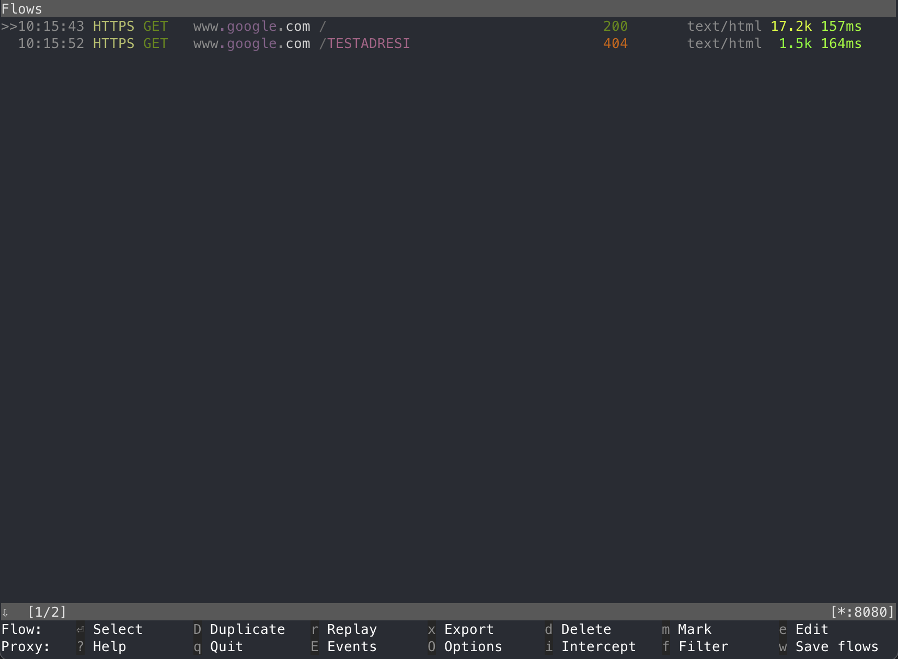
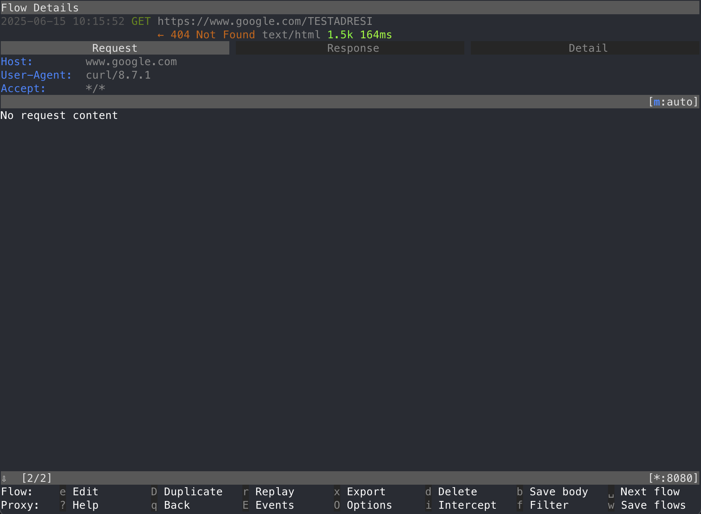

Üçüncü parti servisleri sıklıkla kullanıyoruz. Kendi geliştirdiğimiz bir uygulama üzerinde
çalışıyorsak bu üçüncü parti servislere atılan isteklerin ve alınan cevapların görülmesi çok kolay.
Basit bir şekilde log üreterek servisin doğru çalışıp çalışmadığını anlayabiliyoruz. Peki üzerinde
çalıştığımız sistem başka birileri tarafından yazılmışsa ve bu sistemden atılan isteklerin / alınan
cevapların neler olduğunu görmek istiyorsak nasıl bir yol izleyeceğiz? Öyle ki buradaki sistem
servise atılan istekleri loglamıyorsa isteklerin doğru atılıp atılmadığını, alınan cevabın istenilen
şekilde olup olmadığını nasıl görebiliriz?

Burada `mitmproxy` devreye giriyor. Özetle üçüncü parti servisin adresi yerine kendi sunucumuzun
adresini yazacağız, sunucumuz kendisine gelen istekleri olduğu gibi üçüncü parti servise aktaracak
ve biz de gelen / giden trafiği rahat bir şekilde görebileceğiz.

Yaşanmış bir örnek verecek olursam partner tarafından geliştirilen e-ticaret sistemine üye olan
kullanıcılar için SMS onayı ihtiyacından dolayı SMS firmasının ayarlarını yaptık ancak üyelik
aşamasında SMS gelmediğini gördük. Burada partnerin verebileceği bir log maalesef bulunmadığından
`mitmproxy` aracılığı ile SMS firması ayarlarına kendi adresimizi yazarak hangi isteklerin atıldığnı
ve problemin ne olduğunu doğru bir şekilde tespit edebildik.

## İhtiyaçlar

İhtiyaçlarımız oldukça basit. Bu iş için bir alan adında dışarıdan gelen isteklere cevap veren bir
web sunucusu ile `mitmproxy` uygulamasının olması yeterli.

- Alan adı
- Ubuntu sunucu
- Caddy web sunucusu
- Screen
- Mitmproxy

## Alan Adı

Teoride alan adına sahip olmadan, salt IP adresi ile HTTP üzerinden bunu başarabilecek olsak da
isteklerimizin HTTPS üzerinden güvenli bir şekilde gönderilebilmesi için alan adına ihtiyaç
duyuyoruz. Üçüncü parti servisler yüksek ihtimalle HTTPS üzerinden çalıştığı için ve üzerinde söz
sahibi olamadığımız sistemlerin güvenli bağlantı kurmasından dolayı bunu tercih ediyoruz. Alan adı
veya güvenli bağlantı olmadan çalışacaklarından emin olamadığımız için üçüncü parti servis HTTPS
kullanıyorsa, bizim de bunu aynı şekilde sunabilmemiz mantıklı olacaktır.

Başlamadan önce şirketinizin alan adında veya başka bir alan adı altında kayıt oluşturabildiğinizden
ve bunun `mitmproxy` kurulumu yapacağımız sunucuya yönlendirildiğinden emin olun.

## Ubuntu Sunucu ve Gerekli Paketler

En son LTS sürümü olan 24.04 kullanabilirsiniz. Ubuntu sunucu olması şart olmamakla birlikte
kullanacağınız sürümün de bir önemi yok. Elinizde halihazırda bir sunucu varsa bunu da
değerlendirebilirsiniz. Sadece sunucuya Caddy ve `mitmproxy` kurabildiğinizden emin olun.

Caddy web sunucusu kurulumu için [resmi belgelerden][caddy] ilerleyebilirsiniz. Nginx yerine Caddy
kullanmamızın temel sebebi Let's Encrypt sertifikalarını ekstra bir efor sarf etmeden oluşturması.

Buna ek olarak aşağıdaki komut ile `mitmproxy` kurulumunu gerçekleştirebilirsiniz.

```bash
sudo apt install mitmproxy
```

[caddy]: https://caddyserver.com/docs/install#debian-ubuntu-raspbian

## Screen

SSH oturumumuz sonlansa bile süreçlerin devam etmesi için kullanacağımız terminal çoklayıcısı.
`mitmproxy` sürecini screen altında çalıştıracağız ve böylelikle SSH oturumunuzu kapatsanız bile
arka planda çalışmaya devam edecek.

###  Screen Ayarları

Screen kullanmaya başlamadan önce kullanımı kolaylaştıracak birkaç ayar ile başlayalım. Aşağıdaki
ayarları `~/.screenrc` içerisine kopyalayın. Buradaki ayarlar temelde bize hangi sekmede olduğumuz
bilgisini verecek. Geri kalan ayarlar İngilizce halleri ile açıklanmış durumda.

```plain
# Disable startup message
startup_message off

# Show status bar at bottom
hardstatus alwayslastline
hardstatus string '%{= kG}[ %{G}%H %{g}][%= %{= kw}%?%-Lw%?%{r}(%{W}%n*%f%t%?(%u)%?%{r})%{w}%?%+Lw%?%?%= %{g}][%{B} %m-%d %{W}%c %{g}]'

# Start numbering windows from 1
bind c screen 1
bind ^c screen 1
bind 0 select 10
screen 1

# Enable mouse scrolling and scroll bar history scrolling
termcapinfo xterm* ti@:te@

# Set large scrollback buffer
defscrollback 10000

# Don't display the copyright page
startup_message off

# Tab-completion flashes in heading bar
vbell off

# Automatically detach on hangup
autodetach on

# Change escape sequence to Ctrl+A
escape ^Aa
```

### Screen Kullanımı

Temelde yapacağımız şey bir `screen` oturumu başlatmak ve bu oturum içerisinde komutlarımızı girerek
ilgili süreçleri devam ettirmek. Daha önce screen kullanmamış olanlar için minik bir giriş yapalım.

```bash
screen -S oturumismi
```

Bu komut `oturumismi` adıyla yeni bir screen oturumu başlatır. Terminalinizin alt kısmında fark
edeceğiniz üzere açılışta sadece 1 adet sekme bulunmaktadır. Aynı komutu tekrarlayarak birden fazla
screen oturumu açılabilir ancak yeni oturum başlatmadan önce var olan oturumdan ayrılmak (detach)
gerekmektedir.

Bunun için `Ctrl-a d` tuş kombinasyonları kullanılır. Yani `Ctrl` ve `a` tuşlarına aynı anda basılır
ve çekilir. Sonrasında sadece `d` tuşuna basılır. Buradaki `Ctrl-a` tuş kombinasyonu kaçış dizisi
(escape sequence) olarak adlandırılır. Bir üstteki screen ayarları bölümünün sonunda bunu `Ctrl-a`
olarak ayarladığımızı görebilirsiniz.

!!! note "MacOS kullanıcıları"
    MacOS kullananlar `Ctrl` tuşu için `Control^` tuşunu kullanmalı. Yani burada `Ctrl-a` kaçış
    dizisi görüldüğünde Mac üzerinde `Control-a` tuşlarına basılmalı.

Screen oturumundan ayrıldıktan sonra ekranınızdaki her şeyin oturum öncesi konsol çıktısına dönmesi
gerekiyor. Tekrar oturuma devam etmek için aşağıdaki komutu kullanın.

```bash
screen -r oturumismi
```

Burada var olan oturumları `screen -list` komutu ile de görebilirsiniz. Screen ile çalışırken
normalde `-S` ve `-r` ile belirttiğimiz oturum isimleri zorunlu değil ancak oturum ismi verilmezse
screen otomatik olarak `pid` numarasını oturum ismi olarak kullanıyor ve birden fazla oturum açınca
hangi oturumun ne olduğu anlaşılamayabiliyor. Bu açıdan her daim oturum ismi ile çalışmak
oturumların ne olduğunu daha anlaşılabilir kılıyor.

Oturumdan ayrılma ve tekrar dahil olma pratiğini yaptıktan sonra aşağıdaki kombinasyonlarla screen
oturumunuzu yönetilebilir hale getirebilirsiniz.

- `Ctrl-a c`: yeni bir sekme oluşturur (create)
- `Ctrl-a n`: bir sonraki sekmeye geçer (next)
- `Ctrl-a p`: bir önceki sekmeye geçer (previous)
- `Ctrl-a A`: sekme ismini değiştirir

## Mitmdump

Yazının başında bahsettiğim gibi burada yapmamız gereken bize gelen istekleri olduğu gibi üçüncü
parti servise aktarmak. Bunun için de `mitmdump` kullanacağız ve ana olarak aşağıdaki komutu
çalıştıracağız. Bu komut belirttiğimiz porta gelen istekleri `(5000)`, yine belirttiğimiz sunucuya
aktaracak `(api.servis.com)` ve istekleri bir dosyaya `(servis.flow)` yazacak. Bu komutu yeni bir
screen oturumu içerisinde çalıştırın.

```bash
mitmdump --mode reverse:https://api.servis.com -p 5000 -w servis.flow
```

Artık proxymiz hazır. 5000. port üzerinde aktif ve gelen / giden bütün istekler flow dosyasına
yazılıyor. Devamında yapacağımız aksiyon bu flow dosyasını `mitmproxy` ile okuyarak istekleri görmek
ancak bunun öncesinde bu proxy sunucumuzu dışarıya açmamız gerekmekte. Bunun için de Caddy
kullanacağız.

## Caddy

Burada bir alan adına ihtiyaç olacağını söylemiştim. Alan adınızı proxy sunucusuna yönlendirdikten
sonra Caddy ayarlarını yapmamız gerekmekte. Örnek olması açısından burada `proxy.sirketismi.com`
alan adını kullanacağız.

`/etc/caddy/Caddyfile` dosyasını açın ve aşağıdaki satırları girin.

```plain
proxy.sirketismi.com {
        reverse_proxy :5000
}
```

Sonrasında `service caddy reload` komutu ile sunucuyu yenileyin.

Bu ayar bize SSL sertifikalı bir şekilde 5000. portta oluşturduğumuz mitm sürecini kullanmamıza
olanak sağlayacak.

## Mitmproxy ve Kullanım

Artık tek yapmamız gereken üçüncü parti servis adresininin bulunduğu yerlere `proxy.sirketismi.com`
yazmak. İstekler sunucumuza gelmeye başladığında bunlar `mitmdump` aracılığı ile `servis.flow`
dosyasına kaydolacak. Bu dosyayı `mitmproxy` yardımı ile okuyacağız. `Ctrl-a c` ile yeni bir screen
sekmesi açın ve aşağıdaki komutu girin.

```bash
mitmproxy -r servis.flow
```

Burada bizi aşağıdaki gibi bir arayüz karşılayacak.



Bu arayüzde var olan flowların hepsini görebiliyoruz. Yön tuşları ile detayını görmek istediğiniz
flow'u seçip enter tuşuna basarak bunu görebilirsiniz. Sonrasında ESC tuşu ile tekrar flow listesine
dönebilirsiniz. Örnek olması açısından 404 alınan flowu seçtim ve beni aşağıdaki ekran karşıladı.



Burada yine yön tuşları ile sağa ve sola giderek istek / dönüş / detay bilgilerini görebilirsiniz.

!!! note "Flow dosyası ve yenileme"
    Mitmproxy okuduğumuz bu flow dosyasının o an var olan içeriğini gösterir. Sonrasında bir istek
    gelmişse gelen bu yeni istekler yenilenmez veya gösterilmez. Bunun için mitmproxy'den çıkıp
    tekrar aynı komut ile dosyayı okumamız gerekmekte.

## Sonuç

Kontrolümüzün olmadığı sistemler tarafından üçüncü parti servislere ne tür bir istek atıldığını daha
kolay görebilmek için `mitmproxy` çok faydalı bir araç, hayat kurtarıcı diyebilirim. SMS OTP
örneğinde partner sisteminden isteklerin atıldığını ancak geri dönüşte hata alındığını bu yolla
görebildik. Alınan hata tam anlamıyla karşımıza çıktığı için ve partner sistemi de bu isteği aldığı
için problemi nokta atışı tespit edebildik. Umarım bu araç sizlerin de işinize yarayacaktır.
