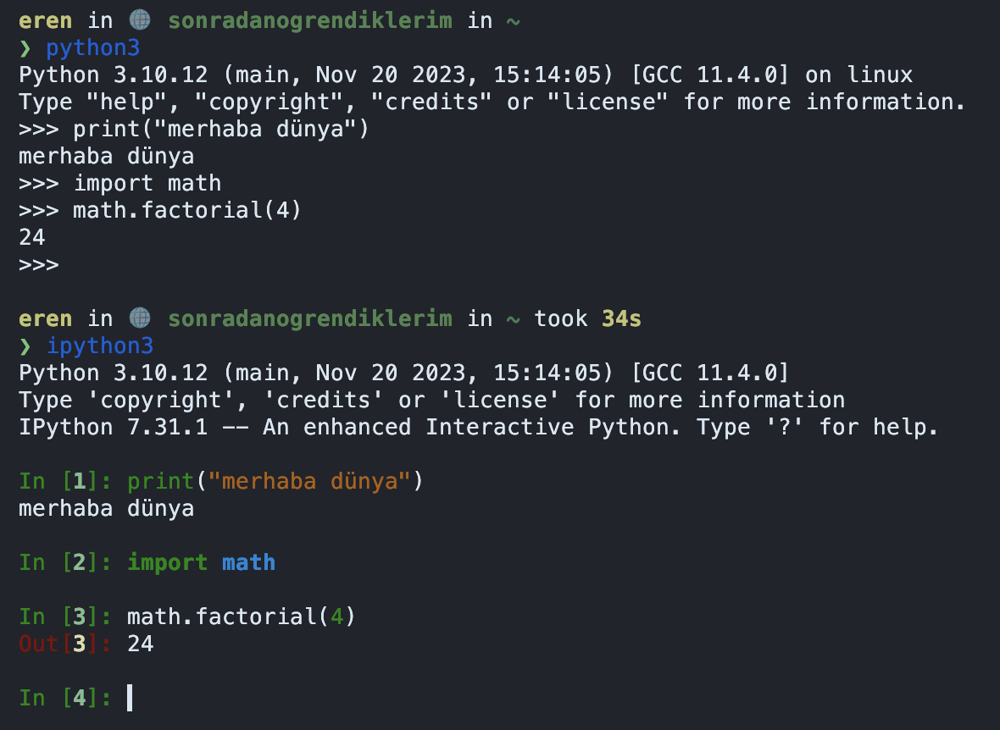

## Giriş

Önceki bölümde programlama dillerinin hangi ihtiyaçtan, nasıl ortaya çıktığına değindik.
[Python][python]{:target="_blank"} da bunlardan bir tanesi. Bu yazıda Python kurulumu, dile basit
bir giriş, modern Python geliştirirken kullanılan araçlar, paket yöneticisi, sanal ortam (virtual
environment) gibi konulara değineceğiz.

Buradaki amaç dili öğretmek değil, geliştirme yaparken sektörde sık kullanılan araçları sizlere
tanıtmak ve geliştirmenizi kolaylaştırmak. Dili daha fazla öğrenmek isterseniz Python'un
[wikisi][wiki]{:target="_blank"} ile birlikte birçok YouTube videosu ve makaleler mevcut.

Burada dikkat etmemiz gereken nokta Python'un da bir program çalıştıran program olduğunu hatırlamak.
Programlama dilleri bölümünde dillerin nasıl ortaya çıktığını anladık, Python da bundan farksız
değil. Yazdığımız programlar bir başka program (Python) tarafından alınıyor, işleniyor ve sonucunda
işlemcinin anlayacağı şekilde 1 ve 0'lara dönüştürülüyor. Bunu yaparken Python bize birçok kolaylık
sağlıyor.

[python]: https://www.python.org
[wiki]: https://wiki.python.org/moin/BeginnersGuide/Programmers

## Python Kurulumu

Önceki yazılarda Ubuntu kullanmamızın yararlı olacağını belirtmiştim. Bundan sonrasında yazacağımız
komutlar her zaman `Ubuntu 22.04` üzerinde olacak. Daha önce güzelleştirilmiş
[terminalinizi](../linux/terminali-guzellestirelim.md){:target="_blank"} açarak aşağıdaki komutu
girin:

```sh
sudo apt-get install python3.10
```

Python yüklendiğinde aşağıdaki çıktıyı görmeniz gerekmekte:

```sh
❯ python3 --version
Python 3.10.12
```

Artık terminalimize `python3` komutunu yazarak kullanmaya başlayabiliriz.

## Python Kullanımı

Terminalimize `python3` yazdığımızda fish veya bash ile benzer şekilde metin tabanlı bir arayüz bizi
karşılayacak. Bu arayüze [REPL][repl] `(Read-Eval-Print-Loop)` denmekte. Aslında terminal de aynı
şekilde bir REPL, sadece bu ismi şu anda hazır olduğumuz için belgenin bu kısmında duyuyoruz.

Python konsolu içerisine aşağıdaki komutu yazdığınızda programlamaya başlamış oluyoruz:

```py
print("merhaba dünya")
```

Görebileceğiniz gibi ekrana çok kolay bir biçimde bir şeyler bastırabildik. Bunu bir önceki bölümde
Assembly ile yapmak çok zordu ve hataya açıktı. Buradan anlıyoruz ki diller aslında bizim işimizi
kolaylaştırıcı bir araç. Dilerseniz burada bir toplama işlemi tanımlayalım ve ne kadar kolay
çağırılabilir olduğunu görelim:

```python
def topla(a, b):
    return a + b

topla(3, 7)
```

Bunları şimdilik konsolda, interaktif şekilde yaptık ancak muhtemelen kodlarımızın kalıcı olmasını
isteyeceğizdir. Bunun için `.py` uzantılı bir dosya oluşturup içerisine yazabiliriz. Yeni shell
komutları ile bu dosya ve dizinleri oluşturalım.

```sh
cd ~
mkdir src
touch src/ilkadim.py
```

- __cd__: Bunu daha önce [terminal makalesinde](../linux/terminali-guzellestirelim.md#ayar-eklemeye-giris){:target="_blank"} görmüştük. Bu komut şu anda bulunduğumuz dizini
  değiştiriyor.
- __mkdir__: `Make directory` anlamına geliyor. Yeni bir dizin oluşturuyor.
- __touch__: Şef dokunuşu. Boş bir dosya oluşturuyor.

Şimdi grafik arayüzünüzden ev dizininde bulunan `src` klasörüne giderek `ilkadim.py` dosyasını metin
editörü ile açın ve içerisine aşağıdakileri yazın:

```py
print("merhaba dünya")

def topla(a, b):
    return a + b

topla(3, 7)
```

Sonrasında konsolunuza dönün ve aşağıdaki komutu girin:

```sh
python3 ilkadim.py
```

Ekrana sadece `merhaba dünya` bastığını göreceksiniz. Python konsolu ve normal şekilde çalıştırma
arasındaki fark var. Python konsolu bir REPL olduğu için en son yazdığınız komutun çıktısını her
daim ekrana basacaktır ancak normal şekilde çalıştırdığımızda ekranda bir şey görmüyor, sadece
topluyoruz. Ekranda bunu görmek için toplama sonucunu bir değişkene atayıp bastırabiliriz:

```py
toplam = topla(3, 7)
print(toplam)
```

Sonucunda tüm programımız şu hali aldı:

```py
print("merhaba dünya")

def topla(a, b):
    # burada boşluklar
    # önemli
    return a + b

toplam = topla(3, 7)
print(toplam)
```

Tekrar konsola dönüp `python3 ilkadim.py` çalıştırdığınızda aşağıdaki çıktıyı görmeniz gerekmekte:

```plain
❯ python ilkadim.py
merhaba dünya
10
```

!!! note "Python ve Boşluklar"
    Dilin yapısı gereği Python'da boşluklar önem arz ediyor. Yukarıdaki kod parçacığını kopyalarken
    boşluklara dikkat etmelisiniz. `def` satırından sonra bir alt satıra geçtiğimizde, bunun `def`
    ile ilgili olduğunu belirtmek için 4 boşluk kullandık. Tek satır olduğundan anlaşılması zor
    olabilir ancak birden fazla satır olduğunda anlaşılması daha kolay olacaktır.

### Biraz Matematiksel İşlem

Toplama işlemi yaptık. Bunu rahatlıkla `+` operatörü ile yapabiliyoruz ancak faktoriyel hesabı
yapmak istediğimizi varsayalım. Bunun için Python bize kendi içerisinde, dışarıdan yüklemeye ihtiyaç
kalmadan birtakım modüller sunuyor. `math` modülü bunlardan bir tanesi. Birçok matematiksel
hesap fonksiyonlarını (metodlarını) barındırıyor ve `factorial` bunlardan bir tanesi. Bu modülü
programımızın başına `import` anahtar kelimesini kullanarak dahil edebiliyoruz.

Yine önce REPL üzerinden ilerleyip, sonrasında bunu kalıcı olması açısından bir dosyaya yazacağız.
`python3` komutu ile REPL'u kullanarak aşağıdaki komutları girin:

```py
import math

math.factorial(4)
```

Sonuç olarak 24 çıkacaktır. Devamında kodu `faktoriyel.py` dosyası içerisine yazın ve kaydedin,
`python3 faktoriyel.py` şeklinde çalıştırın. Oops, ekrana yine bir şeyler yazmayacak. Bunun için
toplama işleminde gördüğümüz gibi `print` yapmanız gerekecek. İlla ki değişkene atamanız
gerekmeyecek. Çok kısa bir ifade olduğu için aşağıdaki şekilde de kullanabilirsiniz:

```py
import math

print(math.factorial(4))
```

!!! tip "REPL ve Kod Tamamlama"
    Python konsolu içerisinde herhangi bir modülün hangi metodlar barındırdığına nokta karakterinden
    sonra TAB tuşuna basarak anlayabilirsiniz. `math` modülü için `math.` yazdıktan sonra TAB tuşuna
    basarsanız neler barındırdığını görebilirsiniz. Aynı zamanda bu metodların nasıl kullanıldığını
    `help` fonksiyonu ile öğrenebilirsiniz. Örneğin factorial için `help(math.factorial)` yazmanız
    yeterli olacaktır.

Sonuç olarak burada kendi kodumuza ait olmayan bir modülü kullandık. Bu modül Python'un kendi
içerisinde gelen bir modüldü ve dışarıdan modül yüklemedik. Python dili sadece kendi içerisinde
modülleri değil, dışarıdan yükleyeceğimiz modülleri de desteklemekte ve etrafta `math` modülü gibi
çok çeşitli işler için çok çeşitli modüller var.

Lakin bu modüllerin kullanılmadan önce sistemimize yüklenmesi gerekiyor. Bu modüllerin yüklenmesinin
de çeşitli yöntemleri var. Şimdi bunlara bakalım.

### Web Sayfası Ziyareti

Sadece matematik işlemi değil, Python ile web sayfasına bağlanabilir, oradan veri alablilir, görsel
ile ilgili işler yapabilir, yapay zeka ve diğer konularda da kullanabilirsiniz. Yani anlayacağınız
Python güçlü bir ekosistemi olan güçlü bir dil.

Bu kısımda sadece bir web sayfasına bağlanıp oradan veri alacağız. Bu veri web sayfasına tarayıcınız
ile bağlanıp `kaynak kodunu göster` dediğinizde karşınıza gelen veri olacak. Bunun için `requests`
adlı çok kullanışlı, Python'un kendi içinde olmayan ama dışarıda geliştirilen bir modül
kullanacağız. Öncesinde belirttiğim gibi önce bunu yüklememiz gerekmekte. Terminalimizi açıp
aşağıdaki komutu girerek bu modülü ^^Ubuntu içerisine^^ yükleyebiliriz:

```sh
sudo apt-get install python3-requests
```

Modül yüklendiğine göre bunu REPL içerisinde `import` edebilmemiz gerekmekte:

```python
import requests
```

Herhangi bir hata almıyorsanız modül başarılı bir şekilde yüklenmiş demektir. Web sayfasının kaynak
kodlarını almak için requests bize `get` metodunu sunuyor. Bunu kullanarak kaynak kodlarını alalım:

```py
import requests

requests.get('https://erenturkay.com')
```

Bu kod parçacığı bize  `<Response [200]>` objesi dönecek.
Buradaki `Response` [objenin ismi][response]{:target="_blank"} ve
`200` [HTTP durum kodu][httpstatus]{:target="_blank"} anlamına geliyor ama bize sadece dönüş yaptı
ve ekrana bastı. Bunu bir değişkene atayıp içerisindekileri okumamız daha anlamlı olacaktır.

```py
import requests

response = requests.get('https://erenturkay.com')

print(response.text)
```

Gördüğümüz gibi `response` objesi içerisinden `text` [metodunu][method]{:target="_blank"} çağırdık.
Response içerisinde çokça metod var. Bunları yine TAB tamamlama özelliği ile görebilirsiniz.
Elimizdeki çıktı tarayıcıdan gördüğümüz kaynak kodları ile aynı olacak.

## Python Konsolunu Güzelleştirelim

`python3` konsolu yeterli olsa da Fish ve Starship shell'de olduğu gibi daha güzel bir REPL mevcut.
Bunun ismi [IPython][ipython]. Bize renklendirme, daha iyi kod tamamlama, satır sayıları gibi birçok
özellik sunuyor. Ben python3 konsolu kullanmak yerine bunu kullanmayı tercih ediyorum ve sistemime
ilk kurduğum yazılımlar arasında.

```sh
sudo apt-get install ipython3
```

Devamında `ipython3` komutu ile bu yeni konsolu çalıştırabilirsiniz. Aradaki farkı tek bir görsel
ile görebiliyoruz. IPython'un en sevdiğim yanı renklendirmesi diyebilirim.

{width=480}

## Paket Yöneticileri

Şimdiye kadar bütün paketleri Ubuntu üzerine yükledik. Bu tek bir proje üzerinde çalışıyorsak
mantıklı olabilir ancak birden fazla proje üzerinde çalıştığımızda bütün projelerin ihtiyaç duyduğu
paketleri (bağımlılıkları) sistemimize yüklemek pek mantıklı değil. Mantıklı değil çünkü bir projede
ihtiyaç duyulan paketin versiyonu ile diğer projenin ihtiyaç duyduğu versiyon farklılık
gösterebilir. En kötüsü, her ikisi de çalışırken sistemdeki paket güncellemesi yapıldığında
projelerin bozulabilecek olması.

Bunun yerine her projeyi kendi içerisinde izole etmek daha tercih edilen bir yöntem. Bunun için
Python'un paket yöneticisi olan [pip][pip]{:target="_blank"} ve projeleri izole etmek için
[virtualenv][virtualenv]{:target="_blank"} kullanıyoruz.

### Pip ve Virtualenv

Her proje başladığında yaptığımız öncelikle bir virtualenv oluşturmak olacak. Bunun için proje
dizini içerisinde `venv` adlı bir dizin kullanılıyor. Bu dizinin ismi `ali`, `sanal` gibi herhangi
bir şey olabilir ancak pratik olması açısından sektörde bunu `venv` ya da gizli olsun istersek
`.venv` yapıyoruz.

Proje dizini içerisinde bir venv oluşturmakla başlayalım ve yaptığımız örnekleri tekrarlayalım. Artık konsola hakim olduğumuz için dizin oluşturma işlemlerini konsoldan yapacağız:

```sh
mkdir -p ~/src/sonradanogrendiklerim
cd ~/src/sonradanogrendiklerim

python3 -m venv venv
```

!!! note "-p parametresi"
    Buradaki -p parametresi eğer `src` dizini öncesinde oluşturulmadıysa bunu da oluştur anlamına
    geliyor. `mkdir` komutu oluşmuş bir dizin içerisinde yeni bir dizin oluşturduğundan, önceki
    aşamada `src` dizini yoksa hata vermemesi açısından kullanılıyor.

Burada Python'un `venv` modülünü kullanarak `(-m venv)` ve `venv` isimli bir dizin ismini son
parametre olarak vererek bize sanal bir ortam oluşturmasını istedik. Ancak bunu istemek, şu an
kullandığımız anlamına gelmiyor. Yalnızca bu proje için oluşturulmuş sanal ortamı aktive etmemiz
gerekmekte. Bunun için konsola aşağıdaki komutu yazın:

```sh
source venv/bin/activate.fish
```

Bir önceki bölümlerde terminalimiz fish idi ve fish ile devam ediyoruz. Bu yüzden aktivasyon için
`activate.fish` kullandık. Eğer bash veya zsh kullanıyorsanız bunu `venv/bin/activate` şeklinde
değiştirmelisiniz. Sonuç olarak konsolumuz şu hali almış olacak:

```sh
eren in 🌐 sonradanogrendiklerim in ~/src/sonradanogrendiklerim via 🐍 v3.10.12 (venv) 
❯ ls
venv
```

Terminalimiz güzelleştiği için venv kullanıp kullanmadığımızı ve hangi Python versiyonu ile
kullandığımızı görebiliyoruz. Artık projeye özel sanal ortamdayız ve sadece projeye özel paketler
yükleyebiliriz.

Önceki örneğimizde `requests` yüklemiştik. Bunun için `pip` ile aşağıdaki komutu girerek yükleyebiliriz:

```sh
pip install requests
```

Bu komut sanal ortamımız aktive olduğundan sadece sanal ortama bunu yükleyecektir. Dikkat ederseniz
paket ismi `python3-requests` değil, sadece `requests` çünkü pip ile yüklediğimizde bunun ismi
sadece `requests`.

Her ortamda farklı paketler olacağı için bu ortam içerisinde şimdilik `ipython` bulunmuyor. Hatırlarsanız bunu sisteme yüklemiştik ve ismi `ipython3` idi. Şimdi bunu yükleyelim. PyPI paket reposu içerisinde bunun ismi sadece `ipython`. Aşağıdaki komut ile kolayca yükleyebilirsiniz:

```sh
pip install ipython
```

### Sanal Ortamdan Çıkma

İşimiz bittiğinde veya başka bir projeye geçeceğimizde içinde bulunduğumuz sanal ortamdan çıkmamız gerekiyor. Bunun için sadece `deactivate` komutunu yazmanız yeterli. Bunu yazdıktan sonra konsolunuz aşağıdaki şekilde size geri bildirimde bulunacaktır:

```sh
eren in 🌐 sonradanogrendiklerim in ~/src/sonradanogrendiklerim via 🐍 v3.10.12 (venv)
❯ deactivate

eren in 🌐 sonradanogrendiklerim in ~/src/sonradanogrendiklerim 
❯
```

## Sonuç

Programlama dillerinin ne olduğunu, nasıl ortaya çıktığını az çok anladık. Python'un program
çalıştıran program olduğunu, sonuç olarak 1 ve 0'lar ile işlem yaptığımızı gördük. Biraz Python
programlamaya, modüllere giriş yaptık ve en önemlisi sektörde çok sık kullanılan virtual environment
konusuna değindik.

Umarım bu kulak aşinalığı ilerleyen projelerinizde işinize yarayacaktır. Özellikle virtualenv ve pip
kullanmanızı, her projede bu pratiği yapmanızı tavsiye ederim.

[repl]:     https://en.wikipedia.org/wiki/Read–eval–print_loop
[ipython]:  https://ipython.org
[pip]:      https://pip.pypa.io/en/stable/
[response]: https://requests.readthedocs.io/en/latest/api/#requests.Response
[method]:   https://requests.readthedocs.io/en/latest/api/#requests.Response.text
[virtualenv]: https://docs.python.org/3.10/library/venv.html
[httpstatus]: https://en.wikipedia.org/wiki/List_of_HTTP_status_codes
